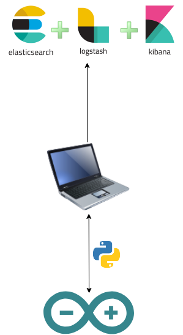
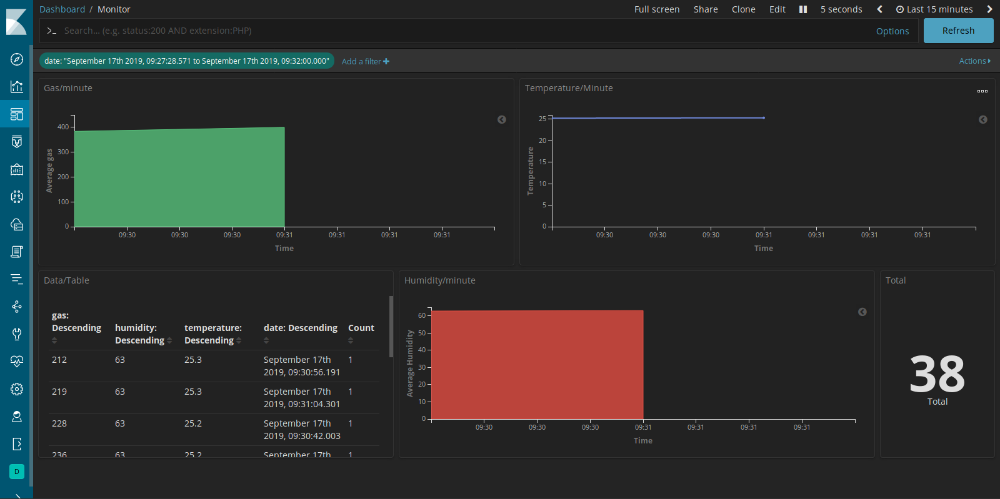

# Arduino + ELK

Using ELK & Arduino (MQ-2 and DHT11) for monitoring humidity, temperature and gas.

Project used for certification in network programming classes at IFRN.

[Associate Degree in Computer Systems Networking](http://diatinf.ifrn.edu.br/doku.php?id=cursos:superiores:redes:start)

### How it works?

The project consists of an Arduino UNO and MQ-2 and DHT11 modules. The data generated by the modules is collected and sent to Elasticsearch using a [Python script](src/run.py).

  

### Images

Kibana dashboard:

  

Arduino circuit:

  

